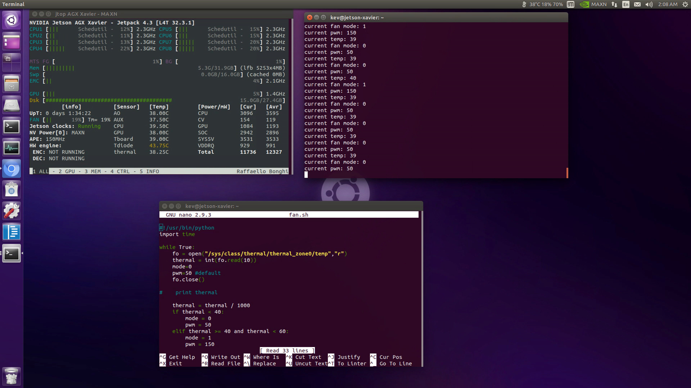

# fan-control

Control the pwm fan with the change of the CPU temperature of any Jetson Desktop. 
This fan control script has three modes 0 , 1 , 2 and its set to different value of pwm. 
You may modify the pwm value associated with the mode in the script. \ \
The default pwm values associated with mode 0 , 1 , 2 are 80, 150 , 255 accordingly

Check out the demo below:

## How to use

1. download the repository \
   $ git clone https://github.com/yqlbu/fan-control/
2. redirect to the repository \
   $ cd fan-control
4. open the .sh or .py file and modify the pwm value based on your preference and save \
   $ vi fan.sh 
5. execute it automatically when the machine is booted \
   $ sudo chmod +x fan.sh \
   $ sudo scp fan.sh /etc/init.d \
   $ sudo crontab -e \
   $ @reboot /etc/init.d/startup.sh
